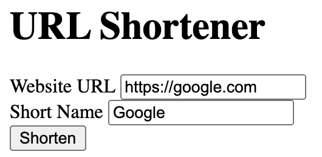
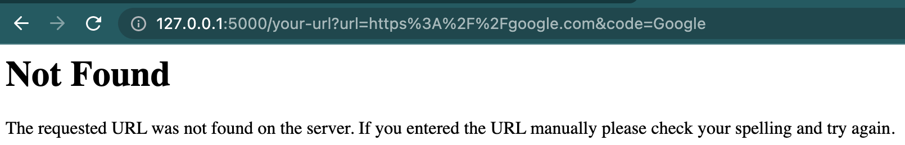
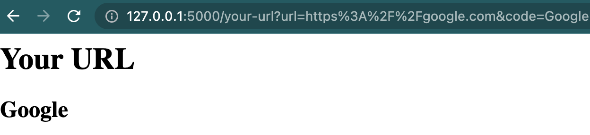
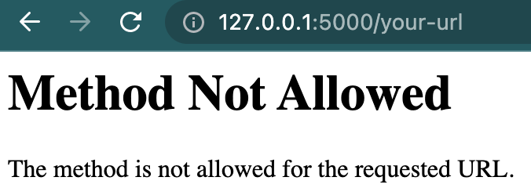
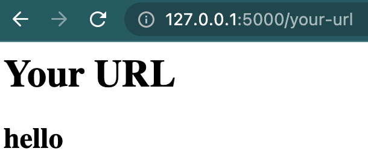
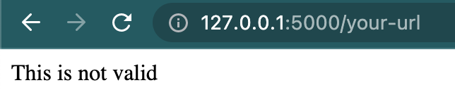

### Setting up pipenv
- virtual envrionment with including Python packages
- can easily manage different packages
- setting up:
    - install pipenv
    ```
    pip3 install pipenv
    ```
    - set the directory to be the pipenv virtual environment
    ```
    pipenv install
    ```
    - launch into the virtual environment
    ```
    pipenv shell
    ```
    - get out of pipenv
    ```
    exit
    ```

### Creating Flask App
- Flask App Object
    ```python
    from flask import Flask

    # creates Falsk object that is running on a server
    app = Flask(__name__)
    print(__name__)
    ```
- **Route**
    - when someone visits the webpage, return back the following contents
    ```python
    app = Flask(__name__)
    
    # specify which url we want the route for
    @app.route('/')     # homepage ==> '/'
    def home():
        print("Hello Flask!")
    ```

### Running Flask App on Terminal
- Run Flask APP on terminal
    ```
    >>> export FLASK_APP=[NAME_OF_CODEFILE]
    >>> flask run
    ```
- Run Flask App in a devleopment environment
    ```
    >>> export FLASK_APP=hello
    >>> export FLASK_ENV=development
    >>> flask run
    ```
    - No need to restart the server when making a change in the code

### Page Templates with Jinja
- Use _Template_ to store all the data in a separate HTML file (just need to load)
- Using page templates:
    1. create a template HTML file in a file directory _templates_
    2. fill in the page templates
        ```html
        <h1>This is Home</h1>
        ```
    3. use _render_template()_ function to load the page template
        ```python
        from flask import Flask, render_template

        app = Flask(__name__)

        @app.route('/')
        def home():
            return render_template('home.html')
        ```
        
- _Jinja_ Template:
    - allows Python-similar codes to be rendered as HTML document
    - reference: https://jinja.palletsprojects.com/en/3.0.x/
    - Ex) passing variables: use **{{ }}**
        ```python
        ...
            return render_template('home.html', name='David')
        ```
        ```html
        <h1>This is home</h1>

        <h2>{{ name }}</h2>
        ```
        

### Passing data with forms - _Get_ Request
- Use _form_ tag to pass data
    - Set up a form with each input and a submit button
        ```html
        <form action="your-url">
            <input type="url" name="url" value="">
            <input type="text" name="code" value="">
            <input type="submit" value="Shorten">
        </form>
        ```
        
    - Add labels for user-friendly design
        ```html
        <form action="your-url">
            <label for="url">Website URL</label>
            <input type="url" name="url" value="">
            <br>
            <label for="code">Short Name</label>
            <input type="text" name="code" value="">
            <br>
            <input type="submit" value="Shorten">
        </form>
        ```
        
    - Add _required_ keyword for each input
        ```html
        ...
        <input type="url" name="url" value="" required>
        ...
        <input type="text" name="code" value="" required>
        ```
        

- Correct Submission:
    
    
    ==> **Get Request**: all the data from a form is **displayed up inside of the URL**

- Pass _form variables_ to other routes
    - Create new route
        - use _request_ to access information from the reqeust
        - _request.args_ is a dictionary for different parameters (ex. args['code']) 
        ```python
        from flask import Flask, render_template, request

        ...

        @app.route('/your-url')
        def shorten():
            return render_template('your_url.html', code=request.args['code'])
        ```
    - Create a new HTML file for the new route with _Jinja_
        ```html
        <h1>Your URL</h1>

        <h2>{{ code }}</h2>
        ```
    

- Get vs Post request
    - **Get request**: all the data are displayed inside the URL
    - **Post request**: take all the information, not displaying in the URL. Instead, we can have access to it inside app.pie file
        - add _method="post"_ keyword in the form tag of home.html
            ```html
            <form action="your-url" method="post">
                <label for="url">Website URL</label>
                ...
            </form>
            ```
            - This still occurs an error since Falsk's security policy only allows default requests for GET.
            
        - add a parameter on Route specfication for **Post**
            ```python
            ...
            @appl.route('/your-url', method=['GET', 'POST'])
            ```
        - add codes to handle when GET request is passed + use **_.form_** keyword for **POST**
            ```python
            ...
            @appl.route('/your-url', method=['GET', 'POST'])
            def your_url():
                if request.method == 'POST':
                    return render_template('your_url.html', code=request.form['code'])
                else:
                    return 'This is not valid'
            ```
            
            - Post request is made
            
            - After entering the url again, a **get** request is made, and will show the invalid message as **Get** request is detected