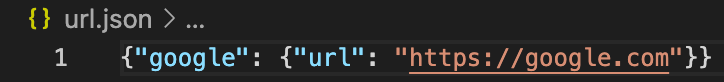
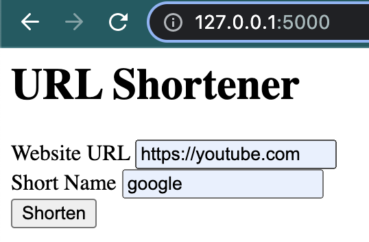
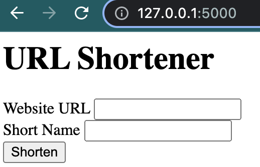
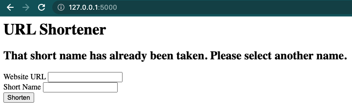
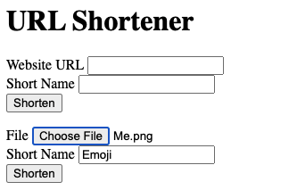
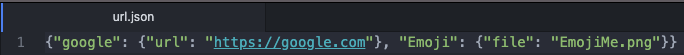
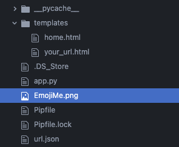

### Error handling: using redirect and url_for
- Using redirect to home page
    - import redirect
    ```python
    import ... , request
    ```
    - use _redirect_ with having home directory ('/')
    ```python
    ...
    else:
        return redirect('/')
    ```
- Using url_for
    - import url_for
    ```python
    import ... , url_for
    ```
    - use _url_for_ that will create the URL based on the function name
    ```python
    else:
        return redirect(url_for('home'))
    ```
    [!url_forRedirect](redirect_urlFor.png)


### Saving to a JSON file
- Saving user input as JSON file -- 1: save dict to json
    - import json
    ```python
    import ... , json
    ```
    - store the data in the form into a dictionary
    ```python
    ...
    if request.method == 'POST':
        urls = {}
        # use shorten name as key
        urls[request.form['code']] = {'url':request.form['url']}
        # create a file and save dictionary as json file
        with open('url.json', 'w') as url_file:
            json.dump(urls, url_file)
    ```
    

- Parsing JSON file for conflicting entries
    - import os.path
        ```python
        ...
        import os.path
        ```
    - load url.json to the current dict if exists
        ```python
        def shorten():
            ...
            if os.path.exists('url.json'):
                with open('url.json') as url_file:
                    urls = json.load(url_file)
        ```
    - redirect to homepage if an existing shorten name is passed
        ```python
        if request.form['code'] in urls.keys():
            return redirect(url_for('home'))
        ```
    
    

- Flash message to display
    - import flash from flask library
        ```python
        from flask import ... , flash
        ```
    - pass flash to the corresponding template
        ```python
        if request.form['code'] in urls.keys():
            flash('That short name has already been taken. Please select another name.')
            ...
        ```
    - display the passed flash message on the template
        ```html
        <!-- use {} for Jinja syntax -->
        <!-- start a for loop to check flash messages -->
        

        <h2>{{ message }}</h2>

        <!-- end the loop -->
        
        ```
    - set scret_key to protect the message
        ```python
        ...
        app = Flask(__name__)
        # set random string for secret_key
        app.secret_key = '124109udaswfjas;ldkfj1424;lsakfdjiji'
        ```
    
- File uploads from users
    - add a new form for file uploads on html
        ```html
        <!-- add enctype="multipart/form-data" for file uplads -->
        <form action="your-url" method="post" enctype="multipart/form-data">
            <label for="file">File</label>
            <input type="file" name="file" value="" required>
            <br>
            <label for="code">Short Name</label>
            <input type="text" name="code" value="" required>
            <br>
            <input type="submit" value="Shorten">
        </form>
        ```
    - check whether user input is a url or file
        ```python
        if 'url' in request.form.keys():
            # url-input
            urls[request.form['code']] = {'url':reqeust.form['url']}
        else:
            # file-input
        ```
    - import secure_filename to ensure safe file from user
        ```python
        import ...
        from werkzeug.utils import secure_filename
        ...
            else:
                # file-input
                f = request.files['file']
                full_name = request.form['code'] + secure_filename(f.filename)
                f.save('DIR/TO/SAVE/' + full_name)
                urls[reqeust.form['code']] = {'file':full_name}
        ```
        
        
        