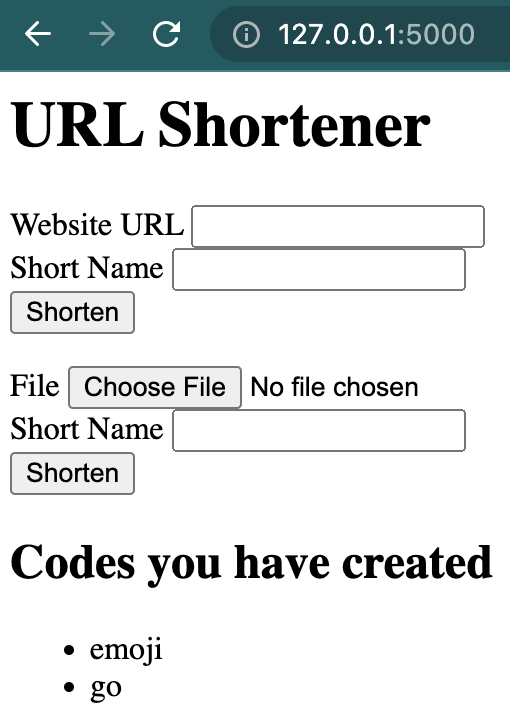

### Implementing **sessions** and **cookies**
- _Flask_ easily saves information into a **cookie**, having the data ready for the users when they come back to the website

- List user's input
    - import **session**
        ```python
        import ... , session
        ```
    
    - save user input (shorten name) into session
        ```python
        ...
        with open('urls.json', 'w') as url_file:
            json.dump(urls, url_file)
            # add the user input as key in session dictionary
            session[request.form['code']] = True
        ```
        - can change the value part (ex. boolean, timestamp, etc.)
    
    - pass the user input(shorten name) to the hompage template
        ```python
        def home():
            return render_template('home.html', codes=session.keys())
        ```
    - add _list_ tag on homepage template
        ```html
        ...

        
        <h2>Codes you have created</h2>
        
        <ul>
            <li> {{ code }}</li>
        </ul>
        
        
        ```
    

- Link the list to the corresponding url
    - add a hyperlink tag on the list
        ```html
        ...
        
        <ul>
            <a href="{{ url_for('redirect_to_url', code=code) }}">
            <li> {{ code }}</li>
            </a>
        </ul>
        
        ```
    

- Creating JSON APIs
    - import _jsonify_
        ```python
        import ... , jsonify
        ```
    - add a new route for json api
        ```python
        @app.route('/api')
        def json_api():
            return jsonify(list(session.keys()))
        ```
    

### Temnplate Blocks and Base Templates
- Templates can extend from one another
- Having **base HTML** can make base components on every single webpage
- Extending base HTML template
    - create a new base template
        ```html
        <h1>THIS IS BASE</h1>

        
        
        ```
    - extend base html from home html
        ```html
        
        
        <!-- start the main block -->
        
        <h1>URL Shortener</h1>

        ...

        
        ```
        

    
